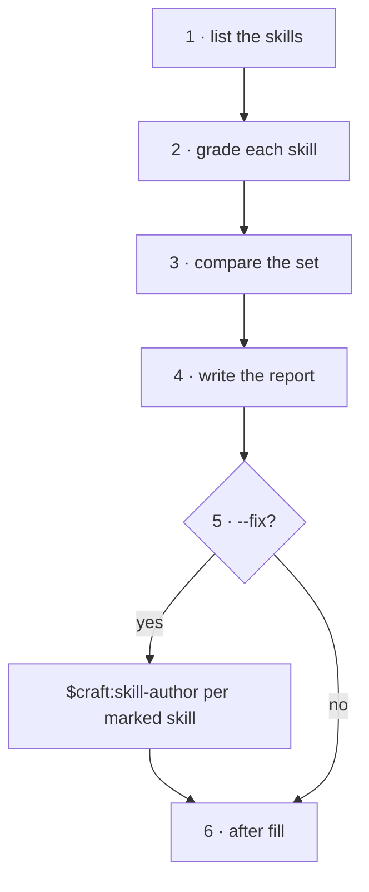

<!-- Generated by agent-pants from plugins/craft/skills/skill-review/skill-review.md; do not edit. -->


# `$craft:skill-review`

Usage:

- `$craft:skill-review <plugin>` reviews every skill in a plugin.
- `$craft:skill-review <path to a skill .md>` reviews one skill.
- `$craft:skill-review <plugin> --fix` also runs `$craft:skill-author` on each skill the report marks.

Scope: the text of skills, judged one by one and as a set. Not in scope: rewriting a skill
(`$craft:skill-author` does that), harness packaging, or running the skills.

Inputs: a plugin or one skill path. Output: a report with one section per skill and one for the
set, every finding carrying a line and one recommendation.

## What it looks for

Per skill, the `$craft:skill-author` grading checks, plus:

- **Drift.** The description promises something the steps do not do, or the reverse.
- **Dead references.** A file, command or skill the text names that no longer exists.

Across the set:

- **Overlap.** Two skills whose scope lines name one process. Recommend a merge.
- **Two processes.** More than about twelve steps or map nodes. Recommend a split.
- **Orphans.** A skill nothing calls and no note documents. Recommend retire or document.
- **Vocabulary.** One thing named two ways across skills. Recommend the one name.



## Steps

0. Read this skill's fills from `sdlc/extend/skills/skill-review.lifecycle` if it exists; apply
   `before` and `rules` now, and the other points where they are named.
1. List the skills in scope: `<plugin>/skills/<name>/<name>.md`, or the one path given.
2. Read each skill and grade it against the checks above. Record every failed check as a
   finding with its line.
3. Read the set: every scope line and every call. Record overlap, two-process, orphan and
   vocabulary findings.
4. Write the report in the shape below, one recommendation per finding: tighten, map, merge,
   split, retire or document. A skill with no finding is listed as clean.
5. With `--fix`, run `$craft:skill-author <path>` for each skill marked tighten or map, then grade
   it again and update its section.
6. Run the `after` fill, if any.

## Report

```markdown
## <skill>
- <check> — line <n>: <recommendation>

## The set
- merge: <a> + <b> — <one process they share>
- retire: <c> — nothing calls it
```

## Extension points

- `rules`: checks added to every skill, for example a house vocabulary.
- `after`: runs after step 5, for example opening a PR with the report or the fixes.

## Grading

- Every finding cites a line, and has exactly one recommendation.
- Every check comes from `$craft:skill-author` or from the list above.
- Every skill in scope appears in the report, clean ones included.
- `--fix` changes only the skills the report marked.

## Test environment

A scratch vault with two skills: one whose scope line matches the other's, and one carrying a
literal `/plugin:name`. Expect a merge finding for the set and a literal-call finding on the
line. With `--fix`, expect the literal fixed and the merge left for a human.
