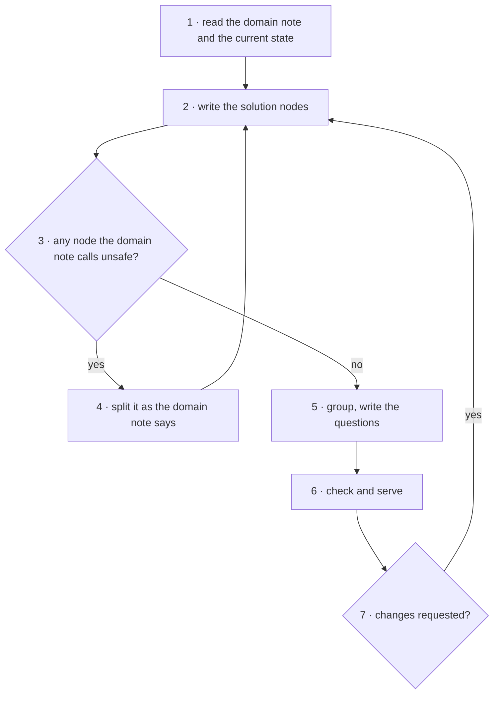

<!-- Generated by agent-pants from plugins/craft/skills/propose-solution/propose-solution.md; do not edit. -->

# `/craft:propose-solution`

Usage:

- `/craft:propose-solution <domain> <one sentence: the change>` proposes it against the repo.
- `/craft:propose-solution sql <sentence> --base <schema doc id>` proposes a database change
  against a schema document.

Scope: one problem to one document with questions. Not in scope: explaining what exists
(`/craft:explain`), applying the solution, or serving the page (`/craft:canvas`).

Inputs: the domain, the problem or change in a sentence, the domain note `domains/<domain>.md`
beside this skill, and what the repo says about the current state. Output:
`docs/canvas/<id>.json`, checked and served, with at least one question.

## What a proposal is

- A `prose` block first that names the problem and the constraint.
- The solution as the blocks the domain note asks for, each node with `summary`, `detail`,
  `risk` and a `warning` wherever a step depends on something outside the document.
- Explanation of what exists is welcome between the solution blocks; write those blocks by the
  `/craft:explain` domain note.
- A question for every trade-off the solution makes, `about` the node it concerns, with
  `recommended` set. The page refuses Approved until every question is answered.

## Steps

1. Read the domain note and the current state; restate the change as the problem it fixes. If
   the domain has no note, say so, suggest one, and proceed on the block types alone.
2. Write the solution nodes in the order they run, ids a word never a number, with the
   domain's fields.
3. For each node, apply the domain note's safety test.
4. If a node fails it, split it the way the domain note says and return to step 2.
5. Group the nodes as the domain note asks and write the questions, each with a
   recommendation.
6. Write `docs/canvas/<id>.json`, run `/craft:canvas check`, then `/craft:canvas serve` and give the
   link.
7. Read the answers with `/craft:canvas` when told. On `changes-requested` return to step 2,
   keeping every node id; on `approved` stop.

## Grading

- Every trade-off has a question with a recommendation, and no question lacks an `about`.
- No node fails the domain note's safety test.
- The first block names the problem and the constraint.
- A rewrite keeps every node id.

## Test environment

`examples/sql/orders-change.json` beside `/craft:canvas` is a reference output. Propose "replace
`orders.shipped` with a status enum" against `orders-schema` and compare.
`examples/sql/orders-design-review.json` shows explanation blocks inside a proposal.
