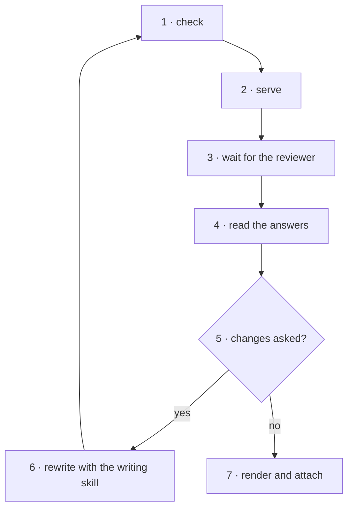

<!-- Generated by agent-pants from plugins/craft/skills/canvas/canvas.md; do not edit. -->

# `/canvas`

Usage:

- `/canvas check <doc.json>` validates a document: ids, anchors, references.
- `/canvas serve [dir]` serves every document in `docs/canvas/` (or `dir`) and watches it.
- `/canvas render <doc.json> --out <page.html>` writes one static page for a PR or an artifact;
  `--out <doc.md>` (or `--format markdown`) writes the same document as markdown: headings,
  lists, tables and mermaid fences, for a PR body, a README or any markdown viewer.
- `/canvas answers <id>` reads `docs/canvas/<id>.answers.json` and reports what the reviewer
  said; `--wait` blocks until the reviewer sends something new, prints it and exits;
  `--reply <id> --text "…" --model <your model id>` answers a comment or an asked-back question
  in place; the page shows who answered on hover.

Scope: validate, render, serve and read back. Not in scope: writing the document
(`/explain` or `/propose-solution` does that) or acting on the answers.

Inputs: a document whose blocks all have a known type. Output: a page at `/d/<id>`, and
`docs/canvas/<id>.answers.json` once the reviewer acts.

## The document

- `id`, `title`, `created`, `blocks`, optional `summary`, `questions` and `repo`. `id` is the
  file stem. `repo` is `{remote, commit, root}`: the GitHub remote, the commit the sources were
  read at, and the absolute path of the checkout.
- `blocks` is an ordered list; the page stacks them. Each has `id`, `type` and an optional
  `title`. Types, in `blocks/types.ts` beside this skill:
  - `prose`: a few paragraphs. One node.
  - `question`: one or more questions placed in the centre column at that point in the
    reading. One node, with a compact walkthrough row for comments on its words; each
    question is one as well.
  - `figure`: one image with a caption and an optional link to its live version; `src` is a
    path under `x/` beside the document (the servlet serves it). One node; the walkthrough
    carries the detail.
  - `annotated-text`: any text with numbered steps anchored into it. One node per step; steps
    may nest. `language: sql` tints keywords. An anchor is a W3C Web Annotation selector:
    `{"type": "TextQuoteSelector", "exact": "…"}` with `prefix` and `suffix` when the quote
    repeats, or `{"type": "TextPositionSelector", "start", "end"}` for offsets.
  - `schema`: tables with columns, keys, indexes and relations, grouped by domain. One node per
    table, and one per column for comments.
  - `operations`: ordered operations with risk, locks, rollback and before/after, grouped into
    phases. One node per operation.
  - `matrix`: rows by columns, each cell valid, warn, error or skip with a note and a hint. One
    node per row; columns are selectable for questions.
  - `trace`: one request walked through ordered candidates, each with an outcome and a reason.
    One node per step.
  - `precedence`: an ordered ladder where the first match wins, with examples showing the rung
    each stops at. One node per rung and per example.
  - `plan`: phases, workstreams and tasks with gate, milestone and status. One node each.
  - `code-flow`: one path through code across functions and files, drawn as a sequence
    diagram: participants are the `symbol`s (or files) the steps run in, messages are the
    steps in order, a `return` is a dashed arrow back, an `emit` an open-headed one, a
    `branch` an alt frame. The mermaid source sits under the diagram. One node per step; the
    walkthrough carries the step's lines, detail and warnings. Use `annotated-text` for one
    text; `code-flow` when the path crosses files.
  - `workflow`: a standard process drawn as a top-down flowchart: a rounded node per step
    with its lane written in it, a diamond for a decision, a stadium for start and end, edges
    labelled with their condition, loops routed on the left. The mermaid source (with lanes
    as subgraphs) sits under the diagram. One node per step and per lane.
- Every node has a stable `id`, unique across the document. Answers key on document id and
  node id, so a regenerated page keeps its answers. Never renumber ids on a rewrite.
- Any node or block may carry `source`, an LSP Location: `{"uri": "<path from the repo root>",
  "range": {"start": {"line", "character"}, "end": {…}}}`, zero-based. The page shows it as a
  local editor link (scheme chosen once per browser) and a GitHub permalink pinned to
  `repo.commit`.
- A question has `kind` single, multi or text, `options`, the agent's `recommended` option, and
  `about`, the node it hangs on. Put a question where the reader meets the thing it decides: a
  question with `about` appears in the walkthrough directly under that node; a `question` block
  appears in the centre column at its place in the reading; a question with neither sits in the
  closing section. The nav, the meter and the sidecar treat all three the same.
- The sidecar holds `status` (`reviewing`, then `changes-requested` or `approved`, with `finished`
  and an optional `summary`), `comments[]` (`node`, `text`, `at`) and `choices` keyed by question
  (`selected`, `note`). A comment made on selected words also carries `selector`, a
  `TextQuoteSelector` with the exact words inside that node; read it as the reviewer pointing
  at those words.
- Every question offers "None of these, or I have a question". That stores `ask` instead of a
  choice, the question stays open, and the reviewer chooses after the agent replies.
- A comment goes to the agent as it is added (it carries `sent`); **Save draft** keeps it private
  until the reviewer sends it, alone or with **Send all**. An asked-back question is sent with its
  own button.
  Under each sent comment or ask is a thread, `replies[]`: the agent's messages (`from` agent,
  `text`, `action` answered, changed or declined, `by`) land there with `--reply` and the open page
  shows them at once; the reviewer's follow-ups (`from` reviewer, `sent`) go to the agent as they
  are added and re-arm `--wait` under the same id. A thread is awaiting the agent while its last
  reviewer message has no agent message after it.
- A new block type is one file under `blocks/` exporting `render`, `check` and `markdown`,
  registered in `blocks/index.ts`. The shell, servlet and sidecar do not change.
- When a subject does not fit the block types above, do not force it into `prose`. Write the
  document with the nearest block, and say in its first prose block what block type would
  have fit, with the fields it needs, so the owner can add it. Do the same for a domain note
  neither `/explain` nor `/propose-solution` has yet.

## The page

- Left: the thing itself, numbered. Right: one scrolling walkthrough, one section per node,
  with its comment box; the agent's questions at the bottom. The walkthrough carries only what
  the left does not show: a step's explanation, a table's columns, an operation's lock and
  rollback. A node the left shows in full (a paragraph, a rung, a task) gets a compact row
  that exists for comments. Put linear reading on the left; keep the right for depth.
- Click or hover any pane and the others highlight. `j`/`k` step sections, `n`/`p` step
  questions (with shift, open ones only; the arrows beside the meter do the same), `Esc`
  clears, the URL hash deep-links a node.
- Select any words in the centre or the walkthrough and a **Comment** pill appears above them;
  the comment lands on the node under the selection, quoting the words, which stay highlighted
  on every later render until they change. Hovering quoted words shows their thread; a click
  goes to it in the walkthrough. **General notes** at the end of the walkthrough take anything
  that is not about one node.
- When the document asks questions, a progress meter under the title shows one segment per
  question: red open, amber asked back, green answered, with a tally. A segment jumps to its
  question in the walkthrough.
- The header shows progress while reviewing (answered count, threads awaiting the agent) and
  one **Finish review** button. It opens a sheet listing what is still open, takes an optional
  summary, and gives the verdict once: **Request changes** (rewrite and come back) or **Approve**
  (build it; disabled while a question is open). Finishing sends every draft. The verdict then
  shows as a chip with **Reopen**.
- Every figure and diagram shows an expand button on hover that opens it full size in a lightbox;
  Esc or a click outside closes it. The pane heads (contents, walkthrough) stay put while their
  pane scrolls, so pin and close are always at hand.
- The servlet's front page lists every document in the folder with its block kinds, verdict,
  answered count and comment count, newest first.
- Appearance follows the system, or is pinned light or dark from the header, per browser.
- Answers save on every change. When the servlet is running they go to the sidecar; a static
  page keeps them in the browser and **Export** shows the same JSON.
- The servlet watches the folder: rewrite the document and the open page reloads where it was;
  rewrite the sidecar and the page re-reads it.

## Steps

0. Read this skill's fills from `sdlc/extend/skills/canvas.lifecycle` if it exists; apply
   `before` and `rules` now, and the other points where they are named.
1. Run `check.ts <doc.json>` from this skill's folder and fix every line it prints. An anchor
   that is not an exact substring is the common one.
2. Run `serve.ts [dir]` from this skill's folder in the background and give the reviewer
   `http://127.0.0.1:4321/d/<id>`. Leave it running.
3. Run `answers.ts <id> --wait` as a background command of your harness, the kind that tells you
   when it exits; it exits the moment the reviewer presses Send, and costs nothing while it waits.
   Never poll the sidecar in a loop, and do not hand the wait to a subagent: the reply needs this
   session's context. If your harness cannot wake you when a background command exits, run
   `answers.ts <id> --notify "<command>"` instead, where the command delivers a line into this
   session (for sdlc hosts, `sdlc session send`); it keeps running and pushes every send.
   On each send, reply with `answers.ts <id> --reply <id> --text "…" --model <your model id>`, or
   rewrite the document if the comment asks for a change, then wait again. The round ends when
   the wait prints `[verdict] …`: the reviewer pressed Finish review.
4. Run `answers.ts <id>` for the digest: the `status` and summary, each question's state, each
   sent comment with the node it is on, each choice with its note.
5. If `status` is `changes-requested`, run `answers.ts <id> --reopen` (status back to `reviewing`,
   answers kept, the page shows it), rewrite the document with the skill that wrote it, and return
   to step 1. Keep every node id. `approved` means every question is answered; the page refuses it
   otherwise. A document with no questions is explanatory: Approve there means read, nothing to
   change.
6. Otherwise run `render.ts <doc.json> --out docs/canvas/<id>.html` and commit the document, the
   sidecar and the page together for the PR. Where the reader has no browser page, render
   `--out docs/canvas/<id>.md` as well and paste or link it; GitHub draws its mermaid fences.
7. Run the `after` fill, if any.

## Extension points

- `rules`: constraints on every document, for example a house list of question kinds.
- `after`: runs after step 6, for example attaching the page to a PR.

## Grading

- `check.ts` prints `ok` for the document.
- The page opens, every numbered node selects, and the highlight follows the walkthrough.
- A comment or choice appears in the sidecar within a second, keyed by node or question id.
- Rewriting the document reloads the open page with its answers intact.

## Test environment

`examples/routing/model-routing.json` uses the four non-text blocks on one page;
`examples/code/ship-order-flow.json` is a `code-flow` across three files;
`examples/process/pr-review.json` is a `workflow` with four lanes.
`examples/sql/` beside this skill holds five documents against one orders database: a query
explanation, a schema, a migration, one page that composes all three, and a long design review that
runs every block type in series (`orders-design-review`). `orders-query-explained` is the query page
with no questions: the explanatory mode. Serve that folder, open each page, comment and choose, and
read the sidecar. Change a title in one document and watch the page reload.
