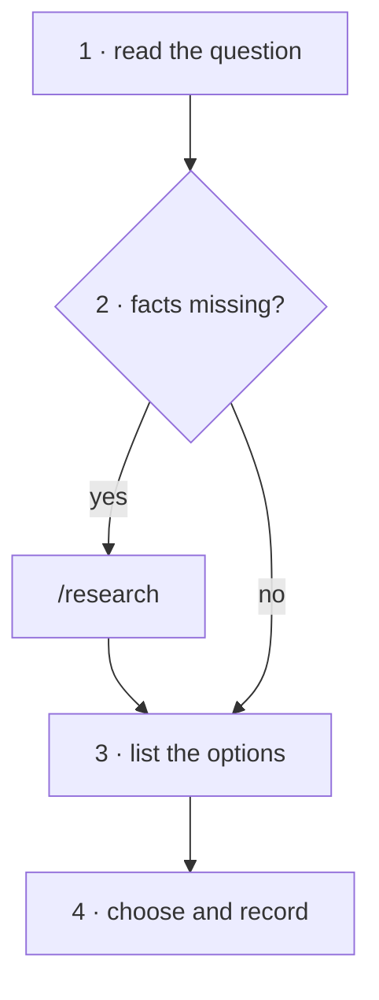

<!-- Generated by agent-pants from plugins/craft/skills/skill-author/skill-author.md; do not edit. -->

# `/skill-author`

Usage:

- `/skill-author <name> — <one sentence: the process>` writes a new skill.
- `/skill-author <path to a skill .md>` tightens an existing skill against the checks below.

Scope: the text of one skill. Not in scope: harness packaging (agent-pants renders it), scripts,
and the sdlc wrapper that adds entity writes and gates.

Inputs: the process in one sentence, and where the skill lives (`craft` for method, `sdlc` for
a wrapper). Output: `<name>/<name>.md` in the vault, graded against the checks below.

## What a minimal skill is

- **One process.** A terse, clear description of one process, done the way we want it done.
- **A scope line.** What it does in one sentence, and what it does not do.
- **Inputs and outputs.** What it needs to start, and what exists when it ends.
- **Steps.** Numbered, short, each an action a reader can take without guessing. No
  background; link instead.
- **Short.** A list wherever a paragraph would do. A step is one or two sentences. A sentence
  that explains is cut or becomes a link.
- **Calls, not names.** Another skill is always `/[[name]]`; agent-pants renders the harness's
  own spelling (see the rules below).
- **A map** (only when the flow branches or loops). One mermaid flowchart whose nodes carry the
  step numbers, so a reader can see the shape and jump to a step. A linear skill has no map.
- **Extension points** (optional). The named points a project fills through
  `sdlc/extend/skills/<skill>.lifecycle`, read before step 1 (see the package note): `before`,
  `rules`, `after`, and `after-<step>` for a step a project is likely to change. A fill adds to
  the skill; it cannot remove a step or skip a check.
- **Grading** (optional). Checks answerable yes or no that separate a good result from a bad
  one.
- **Test environment** (optional). How to set up a scratch target to run the skill against,
  and what to look at afterwards. Required when the skill writes files or calls tools.

## Agent-pants rules

agent-pants (<https://github.com/sksizer/agent-pants>, not yet published) renders every
harness pack from the vault. The rules below apply when it is installed; without it a skill is
still a plain markdown note and `/[[name]]` is still an Obsidian link that reads as a call.

- The skill is `<name>/<name>.md` under its plugin. Frontmatter carries `description`,
  `allowed-tools`, `ap-kind: skill` and `ap-plugin`. The name is lowercase, digits and single
  hyphens, never prefixed with the plugin.
- `/[[name]]` is a call. The build resolves it, refuses it when `name` is not a skill, and
  spells it per harness: `/craft:name` (Claude), `$craft:name` (Codex), `/name` (Cursor),
  `/skill:craft-name` (Pi). It works in prose, inline code and fenced code.
- `[[name]]` is a cite: use it for notes, decisions and docs. A plain `[[skill]]` still renders
  as a call but warns `implicit-skill-call`, so write the sigil.
- Never write a harness spelling (`/craft:name`, `$craft:name`) by hand; the build warns
  `literal-skill-call` and the text is wrong on every other harness.
- `/[[name#Step 5]]` is checked against the target's headings and dropped from the output; use
  it to point a reader at a step in Obsidian.
- The rendered packs (`.claude-plugin/`, `.cursor-plugin/`, `.pi/`, `.agents/`) are generated.
  Edit the vault, rebuild, commit both.

## Map

Draw one when any step branches, loops or dispatches to another skill; the reader should not
have to simulate the steps to learn the shape.

- One `flowchart TD`. Node text is `N · <verb phrase>` where `N` is the step number, so the
  diagram indexes the list below it. Edge labels carry the condition.
- Calls to other skills are nodes too, labelled `/[[name]]`.
- Keep it under about a dozen nodes; a bigger map means the skill does two things.
- It sits between the inputs line and the steps, and the repo's mermaid lint (`mmdc`) must
  parse it.
- A `click S3 href "#step-3"` line is optional. It needs a heading to point at, GitHub's strict
  mermaid mode drops it, and an agent reads the number in the label anyway.

<example>

</example>

## Steps

0. Read this skill's fills from `sdlc/extend/skills/skill-author.lifecycle` if it exists; apply
   `before` and `rules` now, and the other points where they are named.
1. Read the process sentence. Rewrite it until it names one process and one outcome.
2. Search the vault for a skill that already covers it. If one does, tighten or extend that
   skill instead and stop here.
3. Write the frontmatter: `description`, the smallest `allowed-tools` that the steps need,
   `ap-kind: skill`, `ap-plugin`.
4. Write the usage lines, the scope line, and inputs and outputs.
5. Write the steps as a numbered list, one or two sentences each. Cut every sentence that
   explains rather than instructs. Write every other skill as `/[[name]]`.
6. If a step branches, loops or calls another skill, draw the map. Otherwise write none.
7. Add extension points only for steps a project is likely to change. Name each one and say
   where it runs.
8. Write the grading checks. Add the test environment if the skill changes files or calls
   tools.
9. Grade the draft against the checks below. Tighten until every check passes.
10. Run the `after` fill, if any.

## Extension points

- `rules`: constraints applied to every step, for example a house style for skill prose.
- `after`: runs after step 9, for example rebuilding the harness packs and opening a PR.

## Grading

- The scope fits in one sentence, and the out-of-scope line exists.
- Every step is an action. None explains what a link could cover.
- No step is longer than two sentences, and no paragraph outside the scope and inputs lines
  is longer than three.
- Every reference to another skill is `/[[name]]`, and no `/plugin:name` or `$plugin:name`
  text appears.
- A skill with a branch, loop or call has a map; every map node names a step or a call; a
  linear skill has none.
- `allowed-tools` lists nothing a step does not use.
- Each extension point is named and has a stated position, and a skill that declares any
  carries the step 0 line that reads its fills.
- Each grading check is answerable yes or no.
- If agent-pants is installed, `agent-pants check` passes with no `implicit-skill-call` or
  `literal-skill-call` warning for the skill.
- An agent given only the skill and its inputs produces the stated output in the test
  environment.

## Test environment

A scratch vault with one plugin note and the new skill under it. Run `agent-pants check`
against it, then give a fresh session only the skill and one input and compare its output with
the stated output. Keep the transcript with the skill's PR.
