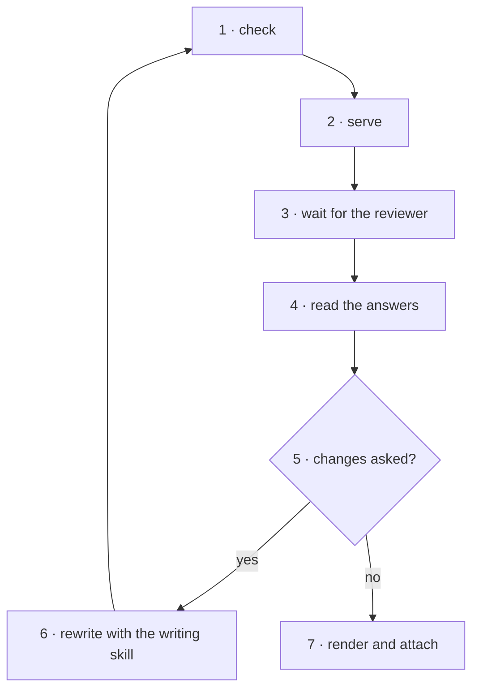

<!-- Generated by agent-pants from plugins/craft/skills/canvas/canvas.md; do not edit. -->

# `/skill:craft-canvas`

Usage:

- `/skill:craft-canvas check <doc.json>` validates a document: ids, anchors, references.
- `/skill:craft-canvas serve [dir]` serves every document in `docs/canvas/` (or `dir`) and watches it.
- `/skill:craft-canvas render <doc.json> --out <page.html>` writes one static page for a PR or an artifact.
- `/skill:craft-canvas answers <id>` reads `docs/canvas/<id>.answers.json` and reports what the reviewer
  said.

Scope: validate, render, serve and read back. Not in scope: writing the document
(`/skill:craft-explain` or `/skill:craft-propose-solution` does that) or acting on the answers.

Inputs: a document whose blocks all have a known type. Output: a page at `/d/<id>`, and
`docs/canvas/<id>.answers.json` once the reviewer acts.

## The document

- `id`, `title`, `created`, `blocks`, optional `summary`, `questions` and `repo`. `id` is the
  file stem. `repo` is `{remote, commit, root}`: the GitHub remote, the commit the sources were
  read at, and the absolute path of the checkout.
- `blocks` is an ordered list; the page stacks them. Each has `id`, `type` and an optional
  `title`. Types, in `blocks/types.ts` beside this skill:
  - `prose`: a few paragraphs. One node.
  - `annotated-text`: any text with numbered steps anchored into it. One node per step; steps
    may nest. `language: sql` tints keywords. An anchor is a W3C Web Annotation selector:
    `{"type": "TextQuoteSelector", "exact": "…"}` with `prefix` and `suffix` when the quote
    repeats, or `{"type": "TextPositionSelector", "start", "end"}` for offsets.
  - `schema`: tables with columns, keys, indexes and relations, grouped by domain. One node per
    table, and one per column for comments.
  - `operations`: ordered operations with risk, locks, rollback and before/after, grouped into
    phases. One node per operation.
- Every node has a stable `id`, unique across the document. Answers key on document id and
  node id, so a regenerated page keeps its answers. Never renumber ids on a rewrite.
- Any node or block may carry `source`, an LSP Location: `{"uri": "<path from the repo root>",
  "range": {"start": {"line", "character"}, "end": {…}}}`, zero-based. The page shows it as a
  local editor link (scheme chosen once per browser) and a GitHub permalink pinned to
  `repo.commit`.
- A question has `kind` single, multi or text, `options`, the agent's `recommended` option, and
  `about`, the node it hangs on.
- The sidecar holds `status`, `comments[]` (`node`, `text`, `at`) and `choices` keyed by question
  (`selected`, `note`). A comment made on selected words also carries `selector`, a
  `TextQuoteSelector` with the exact words inside that node; read it as the reviewer pointing
  at those words.
- A new block type is one file under `blocks/` exporting `render` and `check`, registered in
  `blocks/index.ts`. The shell, servlet and sidecar do not change.
- When a subject does not fit the block types above, do not force it into `prose`. Write the
  document with the nearest block, and say in its first prose block what block type would
  have fit, with the fields it needs, so the owner can add it. Do the same for a domain note
  neither `/skill:craft-explain` nor `/skill:craft-propose-solution` has yet.

## The page

- Left: the thing itself, numbered. Right: one scrolling walkthrough, one section per node,
  with its comment box; the agent's questions at the bottom.
- Click or hover any pane and the others highlight. `j`/`k` step, `Esc` clears, the URL hash
  deep-links a node.
- Select any words in the centre or the walkthrough and a **Comment** pill appears above them;
  the comment lands on the node under the selection, quoting the words, which stay highlighted
  on every later render until they change. **General notes** at the end of the walkthrough take
  anything that is not about one node.
- Appearance follows the system, or is pinned light or dark from the header, per browser.
- Answers save on every change. When the servlet is running they go to the sidecar; a static
  page keeps them in the browser and **Export** shows the same JSON.
- The servlet watches the folder: rewrite the document and the open page reloads where it was;
  rewrite the sidecar and the page re-reads it.

## Steps

0. Read this skill's fills from `sdlc/extend/skills/canvas.lifecycle` if it exists; apply
   `before` and `rules` now, and the other points where they are named.
1. Run `check.ts <doc.json>` from this skill's folder and fix every line it prints. An anchor
   that is not an exact substring is the common one.
2. Run `serve.ts [dir]` from this skill's folder in the background and give the reviewer
   `http://127.0.0.1:4321/d/<id>`. Leave it running.
3. Stop and wait. The reviewer says when they are done, or the next session picks up the
   sidecar; do not poll.
4. Read `docs/canvas/<id>.answers.json`: the `status`, each comment with the node it is on,
   each choice with its note.
5. If `status` is `changes-requested`, or a comment asks for a change, rewrite the document with the
   skill that wrote it and return to step 1. Keep every node id. `approved` means every question is
   answered; the page refuses it otherwise. A document with no questions is explanatory: it has no
   status control, so read its comments and move on.
6. Otherwise run `render.ts <doc.json> --out docs/canvas/<id>.html` and commit the document, the
   sidecar and the page together for the PR.
7. Run the `after` fill, if any.

## Extension points

- `rules`: constraints on every document, for example a house list of question kinds.
- `after`: runs after step 6, for example attaching the page to a PR.

## Grading

- `check.ts` prints `ok` for the document.
- The page opens, every numbered node selects, and the highlight follows the walkthrough.
- A comment or choice appears in the sidecar within a second, keyed by node or question id.
- Rewriting the document reloads the open page with its answers intact.

## Test environment

`examples/sql/` beside this skill holds five documents against one orders database: a query
explanation, a schema, a migration, one page that composes all three, and a long design review that
runs every block type in series (`orders-design-review`). `orders-query-explained` is the query page
with no questions: the explanatory mode. Serve that folder, open each page, comment and choose, and
read the sidecar. Change a title in one document and watch the page reload.
